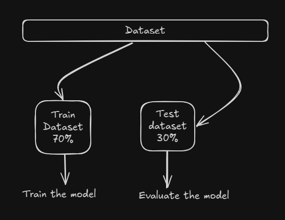
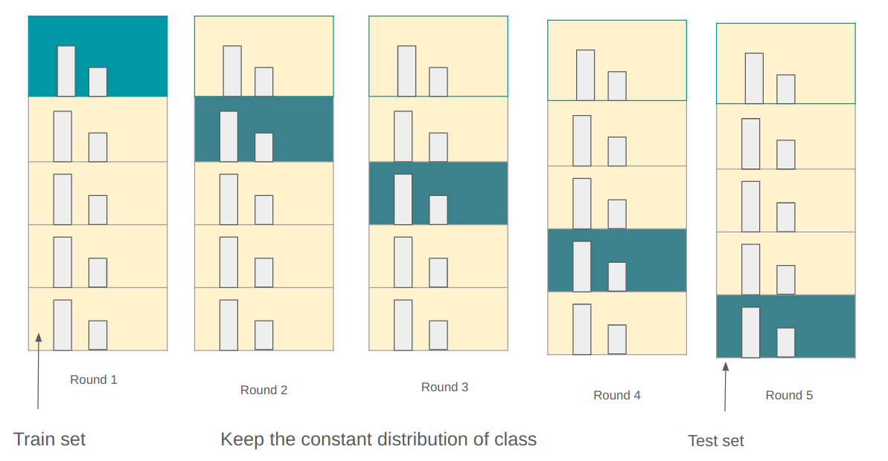
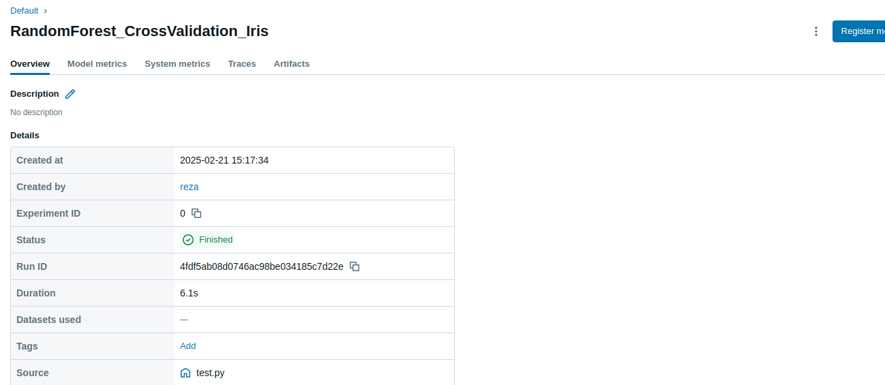
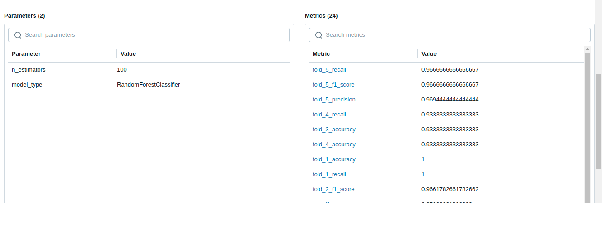
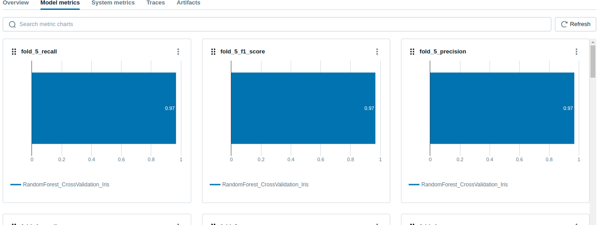
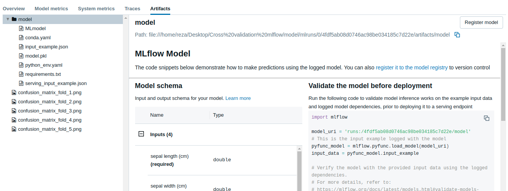
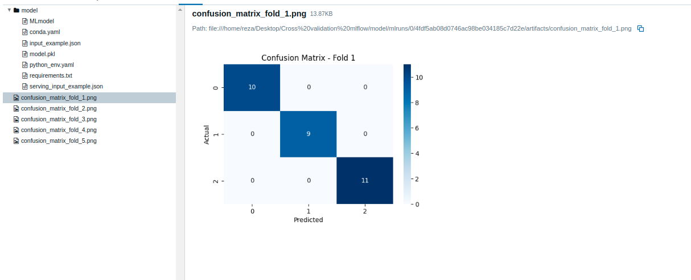
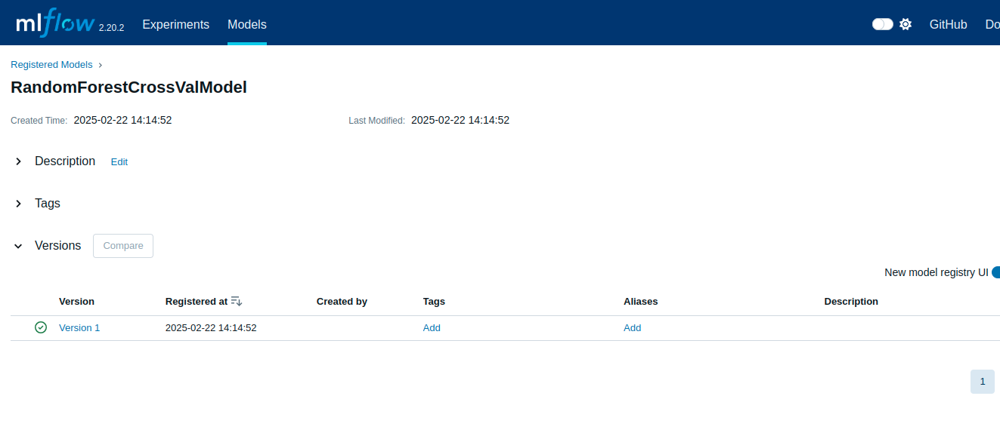

# Cross Validation with MLflow

## 📚 **Introduction**

Cross-validation is a powerful technique for evaluating the performance of machine learning models by testing them on different subsets of data. Unlike the traditional **train-test split**, cross-validation involves training the model on multiple subsets and evaluating it on the remaining subsets, offering a more robust assessment of the model's ability to generalize to new data.

Also known as **rotation estimation** or **out-of-sample testing**, cross-validation splits the original dataset into multiple subsets (folds). The model is trained on all but one fold and tested on the remaining fold. This process is repeated for all folds, helping to reduce overfitting and improve model performance on unseen data.

---

## 🚦 **Why Use Cross-Validation?**

A **95% accuracy** on the training data doesn't necessarily mean your model is well-trained or the best choice. High accuracy on training data might indicate that the model has **memorized the data**, including noise and minor variations, instead of **learning general patterns**. This issue is known as **overfitting**, where the model struggles to perform well on new, unseen data.

On the other hand, if the model fails to find patterns in the training data and performs poorly on both training and test sets, it is **underfitting**. This means the model is **too simple** to capture the **underlying trends** in the data.

---

## 🧠 **Types of Cross-Validation**

### 1. 🛠️ **Hold-Out Cross-Validation**

The **hold-out method**, also known as **train-test split**, is a basic form of cross-validation. It involves splitting the dataset into two subsets: a **training set** for model training and a **test (holdout) set** for evaluating the model's performance on unseen data. This approach provides a quick estimate of how well the model generalizes.





---

### 2. 🔄 **K-Fold Cross-Validation**

**K-Fold Cross-Validation** evaluates a machine learning model's performance by dividing the dataset into **k** equal subsets (folds). The model is trained on **k-1** folds and tested on the remaining fold, repeating this process **k** times so each fold serves as the test set once. The model's performance is averaged across all iterations to provide a robust estimate of how well it may perform on new, unseen data.


---

### 3. 📊 **Stratified K-Fold Cross-Validation**

**Stratified K-Fold Cross-Validation** is a variation of **k-fold cross-validation** that maintains the **same class proportion** in each fold as in the original dataset. This technique is particularly useful when dealing with **imbalanced class distributions**, ensuring a **fair evaluation** of the model's performance.




---

## 🚀 **Cross Validation with MLflow**

Integrating **cross-validation** with **MLflow** offers several advantages:

- **Log Performance Metrics:** Accuracy, precision, recall, F1 score, and custom metrics for each fold.
- **Track Parameters:** Such as hyperparameters used during training.
- **Store Artifacts:** Including trained models, plots, and confusion matrices.
- **Compare Experiments:** To find the best model and hyperparameters.

For this project, I implemented **K-Fold Cross-Validation** on the **Iris dataset** and logged various **metrics** using **MLflow**.

---

## 🛠️ **Setup Instructions**

1. **Create a Virtual Environment:**

```sh
python3 -m venv venv
```

2. **Install Dependencies:**

```sh
pip install -r requirements.txt
```

3. **Run MLflow Tracking Server:**

```sh
mlflow ui
```

4. **Run the Model/Code:**

```sh
python test.py
```

5. **Access the MLflow UI:**

```sh
mlflow ui
```

- Navigate to **`http://localhost:5000`** to explore the **MLflow UI**.

---

## 📊 **Results & Visualization**

After a successful run, you will see the following MLflow UI screen:



### **Metrics & Parameters**

The UI displays the **model parameters** (`n_estimators`, `model_type`) and **metrics** (`f1_score`, `recall`, `precision`) logged for each fold.



### **Model Metrics**

The **Model Metrics** section shows the **corresponding metrics** and their values.



### **Artifacts Section**

In the **artifacts section**, you can find:



- The **model pickle file** for deployment.
- **Confusion matrix images** for each fold.




---

## 📖 **Learn More**

For a deeper understanding of **cross-validation**, check out this detailed [blog post](https://medium.com/@ompramod9921/cross-validation-623620ff84c2).

---

## 📦 Model Registration with MLflow

Model Registration in **MLflow** refers to **storing a trained machine learning model** in the **Model Registry**, which acts as a **centralized repository** for **model management**. It allows you to **version models**, **track model lineage**, and **manage model lifecycle stages** (**e.g., Staging, Production, Archived**).

---

### ✅ **Need for MLflow Model Registry**

#### 1. 🚦 **Version Control:**
- **Every registered model** is **assigned a version** (**v1**, **v2**, **v3**, ...).
- Helps to **track improvements** and **changes to models** over **time**.
- Allows **rollback** to **previous versions** if **newer models underperform**.

#### 2. 🔄 **Lifecycle Management:**
- Models can be **transitioned through stages**, including:
  - **None:** The model is **registered** but **not ready for use**.
  - **Staging:** The model is **under testing or validation**.
  - **Production:** The model is **approved and ready for deployment**.
  - **Archived:** The model is **retired but kept for reference**.

#### 3. 🚀 **Model Deployment:**
- **Registered models** can be **deployed directly** using **MLflow serving**.
- Supports **serving models as REST APIs** with **version control**.

#### 4. 🤝 **Facilitate Collaboration:**
- Provides a **central place** for **data scientists**, **ML engineers**, and **stakeholders** to **view and manage models**.
- **Team members** can **review model performance**, **test new versions**, and **approve deployment**.


The above image shows the **saved version** of the **RandomForest model** in the **Model Registry**.

---

## 💡 **Conclusion**

This **project demonstrates** how **cross-validation** combined with **MLflow** can **enhance the model evaluation process** by providing **comprehensive insights** into **model performance** across **multiple folds**. By **visualizing metrics**, **tracking hyperparameters**, and **storing artifacts**, **MLflow** proves to be an **invaluable tool** for **machine learning experiments**. Additionally, the **model is saved into the Model Registry** for **further use and deployment**.


